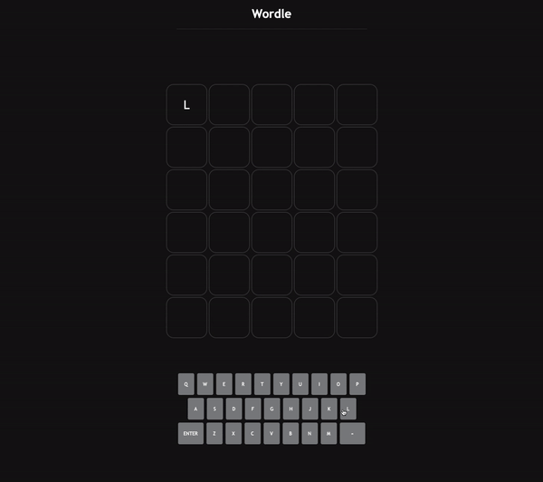

<h1 align="center">Wordle Clone</h1>
<p>
  <a href="https://www.npmjs.com/package/wordle" target="_blank">
    
  </a>
  <a href="#" target="_blank">
    
  </a>
</p>

<p style="font-size: 1.2rem; text-align: center;">A clone of the Wordle game in JavaScript, with the added benefit of using API's to generate random 5-letter words and verify that the words we are using for our guesses exist!</p>

<div style="display: flex">
  
</div>

## API

> Random Word API: https://bit.ly/random-word-api
> Dictionary API: https://bit.ly/dictionary-api

## Getting Started

To start this project please go to RapidAPI to sign up for the APIs.

_Create a .env file in the root of your project with the following:_

```sh
RAPID_API_KEY={your_rapid_api_key}
```

## Install

```sh
npm install
```

## Run backend

```sh
npm run start:backend
```

## Run tests

```sh
npm run test
```

This will start the backend on http://localhost:8000.

## Show your support

Project developed with the support of the tutorial made by @kubowania.
Here's the video: [Wordle JS](https://www.youtube.com/watch?v=mpby4HiElek&t=26s)

##### [readme-md-generator](https://github.com/kefranabg/readme-md-generator)
---

